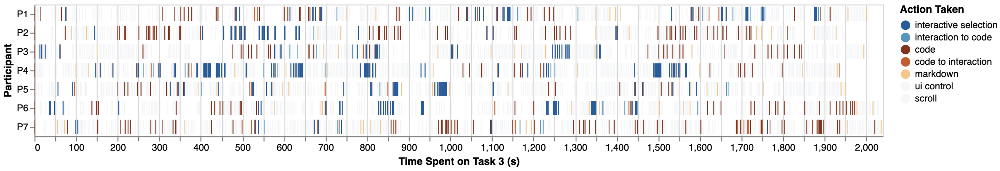

class: left, bottom, title-slide, inverse

.gray[Data Visualization Show & Tell]

# B2 .gray[(.strike[English level])]

## Bridging .text-highlight[Code] and .text-highlight[Interactive Visualization] in Computational .text-highlight[Notebooks]

Yifan Wu, Joseph M. Hellerstein, Arvind Satyanarayan (UIST 2020)

---

class: inverse

# .over[What is this paper about?] &#129300;

## TL;DR

B2 is a set of ideas and an extension for Jupyter Notebook to improve the .text-highlight[data analysis workflow] considering interactive charts and their reproducibility/display.

--

In other words, how can .text-highlight[interactive charts] be leveraged on notebooks?

--

## Keywords

(Exploratory) Data Analysis

--

.pull-left[
- Data Visualization

- Vega-Lite
]

--

.pull-right[
- Literate programming

- Jupyter Notebook
]

---

class: inverse

# .over[How is it structured?] &#128450;

1. Introduction

2. B2 demo (case study style)

3. Related work

4. *Theoretical* considerations

5. System design and implementation

6. Evaluation 
  - First-use study w/ 7 participants (low number due to COVID-19)
  - *Metrified* notebook and qualitative feedback
  
7. Conclusion
  
---

class: middle center inverse

Participants' interaction traces while working on one of the tasks.

---

class: inverse

# .over[Entry point] &#9961;

## Isolation

"Currently, although (...) [code cells and visualizations] may be interleaved, they remain .text-highlight[siloed]: 

interactive visualizations must be manually specified as they are divorced from the analysis provenance expressed via data frames, while code cells have no access to users' interactions with visualizations (...)."

--

## Shared representation

"The fundamental task of data analysis involves .text-highlight[iterative data transformation], and both code [via data frame manipulations] and interactive visualizations [via interactive selections] can capture this task as a data query."

--

In this paper, "interactive selections" are based on Vega-Lite's .text-highlight[*selections*]. They map user input (like a mouse click) into data queries, which can subsequently be used to filter data points, for example.

---

class: inverse

# .over[The three gaps] &#128679;

## Semantic gap

This gap "(...) prevents each side [code cells and visualizations] from understanding the work that is happening in the other;"

"(...) an analyst must manually construct appropriate interactive visualizations from scratch even if the code that specifies the data frame captures semantics that can automate visualization design." 

---

class: inverse

# .over[The three gaps] &#128679;

## Semantic gap

This gap "(...) prevents each side [code cells and visualizations] from .text-highlight[understanding the work] that is happening in the other;"

## Temporal gap

This gap "(...) allows only code to .text-highlight[persist], and only interactions on visualizations to be .text-highlight[transient];"

--

## Layout gap

This gap occurs "(...) between the notebook's .text-highlight[linear] structure and rich coordinated .text-highlight[multi-view visualizations]."

---

class: inverse

# .over[Key features] &#128657;

- .text-highlight[Dashboard panel]

  - The charts are displayed on a dashboard located to the right of the notebook in order to facilitate (interactive) multi-view displays (regardless of the source cell).

--

- .text-highlight[Interaction log]

  - Interactive selections are represented by their underlying predicate definitions in code cells.

--

- .text-highlight[Reactive cells]

  - Cells marked as *reactive* (via the `%%reactive` IPython magic command) are automatically recomputed when new interactions occur.
  
--

- .text-highlight[*Auto plotting*]

  - Charts can be *inferred* from a data frame or from the list of columns available on the dashboard (heuristic-based).
  
  - If two data frames derive from the same data frame, the generated charts will be linked.

---

class: inverse

# .over[*Intermediate* remarks] &#128640;

## Placing Data Visualization in the workflow

"(...) we should work on standardized data .text-highlight[interfaces for visualization for both input and output data]. Input data is defined as the data used for the visualization. Output data is defined as data created by interacting with the visualization (e.g., selections, filtering)." (Schmidt & Ortner, 2020)

--

## Leveraging Data Visualization *in practice*

In practice, it is sometimes easier and faster to manipulate a data frame, draw some conclusions, and proceed with the analysis — instead of creating and using a chart. This approximation of charts to data manipulation seems, at least at first glance, to invite the user to plot data.

---

class: middle center inverse

# .text-highlight[Demo!]
## .strike[&#128520;]  &#128211; &#128202;  
